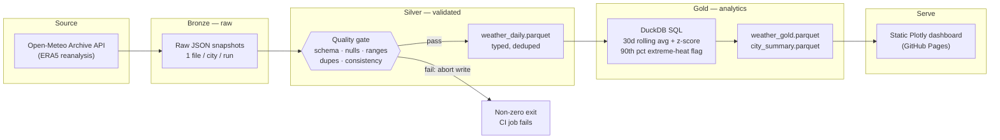
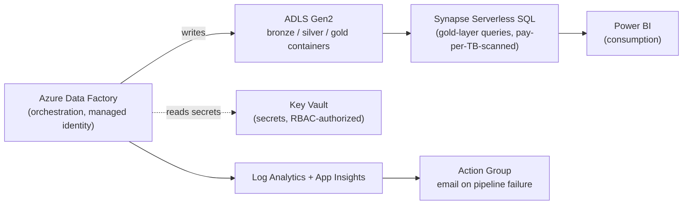

# AU Weather Medallion Pipeline

[](https://github.com/vabhishek8/azure-medallion-weather-pipeline/actions/workflows/pipeline.yml)

A production-pattern **bronze → silver → gold** data pipeline that ingests
daily weather for the five largest Australian capital cities, runs it
through an explicit data-quality gate, computes rolling anomaly detection
in SQL, and publishes a static analytics dashboard — orchestrated on a
real schedule, not a one-off notebook run.

**[Live dashboard →](https://vabhishek8.github.io/azure-medallion-weather-pipeline/)**

Built to answer one question honestly: what does an Azure Data Engineer's
actual day-to-day judgment look like, end to end — ingestion failure
handling, data quality gating, cost-aware architecture choices, IaC,
testing, and CI — not just "wrote a SQL query."

---

## Why this project exists

Most portfolio ETL projects are `load_csv() → run_query() → done`. That
doesn't demonstrate anything a hiring manager can't already assume. This
project is scoped instead around the decisions that actually separate a
junior pipeline from a senior one:

- What happens when the upstream API returns partial data for one city but not the others?
- What's the contract between "raw" and "trusted" data, and who enforces it?
- Where does SQL belong vs. where does application code belong?
- What does this cost to run in production, and how do you avoid it costing more than it should?

---

## Architecture



Orchestration is a scheduled GitHub Actions workflow (daily cron +
on-push + manual dispatch): test job runs first, and the pipeline job
only executes on green tests. A failed quality gate or a failed API call
fails the run loudly — nothing downstream silently continues on bad data.

## Production Azure mapping

The pipeline above runs on GitHub Actions + DuckDB because that's free
and appropriately sized for 5 cities × 1 row/day. `infra/main.bicep`
is the same design translated to a governed Azure estate — this is what
changes (and what doesn't) going from a portfolio-scale pipeline to a
production one:



Deliberate choices, not defaults:

| Decision | Reasoning |
|---|---|
| Synapse **serverless** SQL, not a dedicated pool | Dedicated pools bill hourly regardless of load — indefensible for a low-volume workload. Serverless bills per TB scanned. |
| Managed identity + RBAC, no shared keys/connection strings | ADF and Synapse get `Storage Blob Data Contributor` scoped to one storage account, nothing broader. Secrets live in Key Vault, not pipeline JSON. |
| `Standard_LRS` in dev, `Standard_ZRS` in prod | Zone-redundant storage is a prod-only cost; dev doesn't need it. |
| Not deployed and left running | A standing ADF + Synapse estate for a 5-row/day dataset has real, ongoing cost with no proportional benefit. Deploy on demand, validate, tear down — the template is the deliverable, not a permanently running resource. |
| Metric alert on `PipelineFailedRuns` → email | A failed pipeline that nobody notices until a dashboard looks stale is a monitoring gap, not just a missing feature. |

Deploy it yourself:

```bash
az deployment group create \
  --resource-group rg-weather-pipeline-dev \
  --template-file infra/main.bicep \
  --parameters environment=dev alertEmail=you@example.com
```

Validated with `bicep build` (0 errors) — see `infra/main.bicep` for the full template (storage, ADF, Synapse, Key Vault, Log Analytics, alerting, RBAC role assignments).

---

## Data quality gate

Every silver write goes through `src/quality_checks.py` before it's
persisted — schema completeness, null thresholds, physically-plausible
range bounds per field, duplicate `(city, date)` detection, and
max/min-temperature consistency. A failing check aborts the write with a
structured report; nothing gets to gold un-validated. This isn't
decorative — it's what caught a real bug during development: Open-Meteo's
*forecast* endpoint returns sparse humidity data beyond a short lookback
window, which showed up as quality warnings and drove the switch to the
*archive* (reanalysis) endpoint used today.

## Gold-layer analytics

Computed in DuckDB SQL over the silver Parquet file (same execution model
as querying ADLS Gen2 via Synapse Serverless SQL):

- `temp_anomaly_c` / `temp_anomaly_zscore` — deviation from a 30-day trailing mean/stddev, computed as a window function
- `is_extreme_heat` — max temp ≥ 95th percentile of a trailing 90-day window
- `rain_flag` — binary wet/dry day
- City-level summary — averages, peaks, extreme-heat day counts

## Running locally

```bash
python -m venv .venv && source .venv/bin/activate
pip install -r requirements.txt
python src/pipeline.py          # bronze -> silver -> gold -> dashboard
PYTHONPATH=src pytest tests/ -v # 15 tests: quality gate, transform, gold SQL
open docs/index.html
```

## Repo layout

```
src/
  ingest.py          bronze: Open-Meteo archive API, retry + partial-failure handling
  transform.py        silver: parse + validate + dedupe
  quality_checks.py   the quality gate (schema/nulls/ranges/dupes/consistency)
  gold.py              gold: DuckDB SQL, rolling anomaly detection
  dashboard.py         renders gold -> static Plotly HTML
  pipeline.py           orchestrates all four stages
tests/                 15 pytest cases covering the gate, transform, and SQL logic
infra/main.bicep       production Azure IaC (ADF, ADLS Gen2, Synapse, Key Vault, monitoring)
.github/workflows/     scheduled CI: test -> run -> commit refreshed gold data
```

## Stack

Python · pandas · DuckDB · Plotly · pytest · GitHub Actions · Bicep (Azure Data Factory, ADLS Gen2, Synapse Serverless SQL, Key Vault, Log Analytics, Application Insights)

---

Built by [Abhishek Vadlamudi](https://abhishekvadlamudi.com) — Senior BI Engineer positioning toward Azure Data Engineering.
